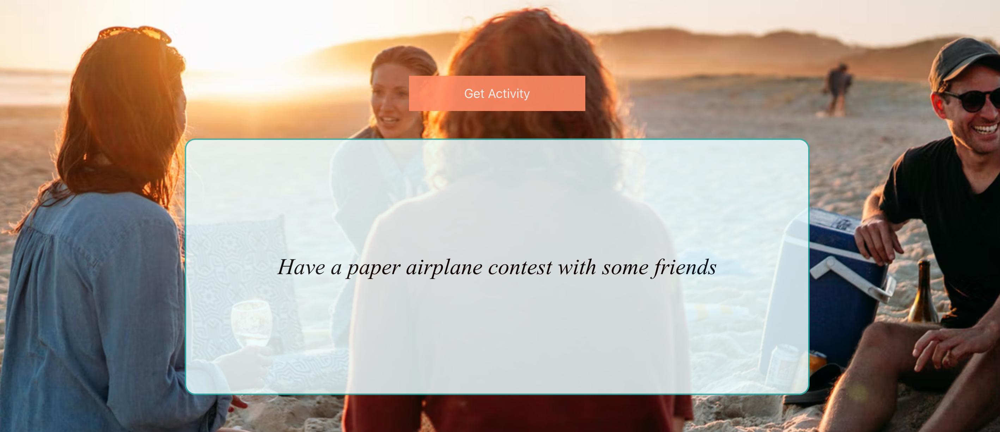

# Never Be Bored!

## Description
Do you get bored often? Hopefully not, but if you do, this VERY simple app has you covered! All you need to do is hit the 'Get Activity' button, and this API will deliver an endless stream of activities for you to do. One key feature and is that it has many types of activities for you to try, and based on the type of activity, the background image will change to match that category. That's about it, so go have fun relaxing, being productive, staying busy, or whatever else you randomly get when you hit the button!

## Table of Contents
- [Description](#description)
- [Installation](#installation)
- [Usage](#usage)
- [License](#license)
- [Screenshots](#screenshots)
- [Links](#links)
- [Resources / Credits](#credits)

## Installation
* No installation necessary.

## Usage
* Follow the link to the deployed site below.

## License
Permission is hereby granted, free of charge, to any person obtaining a copy of this software and associated documentation files (the "Software"), to deal in the Software without restriction, including without limitation the rights to use, copy, modify, merge, publish, distribute, sublicense, and/or sell copies of the Software, and to permit persons to whom the Software is furnished to do so, subject to the following conditions:

The above copyright notice and this permission notice shall be included in all copies or substantial portions of the Software.

THE SOFTWARE IS PROVIDED "AS IS", WITHOUT WARRANTY OF ANY KIND, EXPRESS OR IMPLIED, INCLUDING BUT NOT LIMITED TO THE WARRANTIES OF MERCHANTABILITY, FITNESS FOR A PARTICULAR PURPOSE AND NONINFRINGEMENT. IN NO EVENT SHALL THE AUTHORS OR COPYRIGHT HOLDERS BE LIABLE FOR ANY CLAIM, DAMAGES OR OTHER LIABILITY, WHETHER IN AN ACTION OF CONTRACT, TORT OR OTHERWISE, ARISING FROM, OUT OF OR IN CONNECTION WITH THE SOFTWARE OR THE USE OR OTHER DEALINGS IN THE SOFTWARE.

## Screenshots

 

## Links

* Deployed Link at GH Pages: https://jonteal.github.io/never-be-bored/
* Github Repository: https://github.com/jonteal/never-be-bored

## Resources / Credits
* Bored API: https://www.boredapi.com/

* Button animation: Simple CSS Button Hover Effects - Natalia Reshetnikova - CodePen